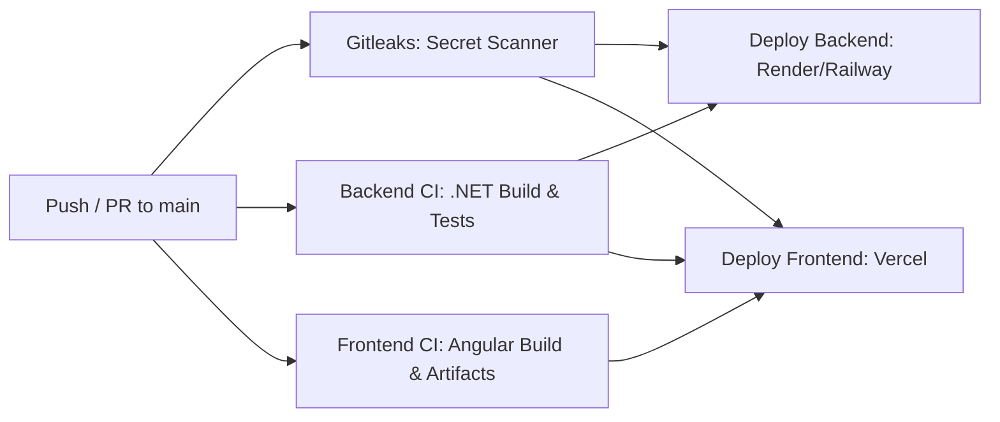

# Farmfinancer Production Deployment & CI/CD Guide

This guide walks you through deploying the full-stack **Farmfinancer** application professionally with:
- **Frontend (Angular SPA)**: Hosted on **Vercel** with global CDN and automatic SSL.
- **Backend (ASP.NET Core 6 Web API)**: Hosted on **Render** or **Railway** via containerized Docker service.
- **Database (Microsoft SQL Server)**: Cloud-hosted database with automatic startup migrations.
- **CI/CD Pipeline**: Automated testing, linting, and multi-stage deployment via **GitHub Actions**.

---

## 1. Automated CI/CD Pipeline Overview

The project includes an enterprise-grade GitHub Actions workflow in [`.github/workflows/ci-cd.yml`](file:///.github/workflows/ci-cd.yml):



### Workflow Features:
- **Gitleaks Secret Scanner (`gitleaks`)**: Scans all commits and code for leaked API keys, tokens, and credentials using `.gitleaks.toml`.
- **Backend CI (`backend-ci`)**: Restores NuGet dependencies with caching, compiles ASP.NET Core 6 in Release mode, and runs unit tests.
- **Frontend CI (`frontend-ci`)**: Installs dependencies with `--legacy-peer-deps`, compiles production Angular bundle with OpenSSL compatibility, and archives production build artifacts.
- **Deploy Frontend (`deploy-frontend-vercel`)**: Automatically deploys the Angular app to Vercel on merges to `main`.
- **Deploy Backend (`deploy-backend`)**: Triggers an automated webhook deployment for the backend container on Render or Railway.

---

## 2. Deploying Frontend to Vercel

### Method A: Vercel GitHub App Integration (Easiest & Recommended)
1. Go to [vercel.com](https://vercel.com) and log in with your GitHub account.
2. Click **"Add New..."** > **"Project"**.
3. Import your repository: `Pulkit1822/Farmfinancer`.
4. Configure the project settings:
   - **Framework Preset**: `Angular`
   - **Root Directory**: Click *Edit* and select `angularapp`
   - **Build Command**: `npm run build` (or leave default)
   - **Output Directory**: `dist/angularapp`
   - **Install Command**: `npm install --legacy-peer-deps`
5. Under **Environment Variables**, add:
   - `apiUrl`: URL of your backend API (e.g., `https://farmfinancer-api.onrender.com`)
   - `baseUrl`: URL of your backend API with `/api` (e.g., `https://farmfinancer-api.onrender.com/api`)
6. Click **Deploy**. Vercel will build and assign you a live HTTPS domain (e.g. `https://farmfinancer-app.vercel.app`).

### Method B: Automated Deployment via GitHub Actions
To let the GitHub Actions pipeline deploy directly to Vercel:
1. In Vercel, go to **Account Settings** > **Tokens** > **Create Token**.
2. Go to your GitHub repository: **Settings** > **Secrets and variables** > **Actions** > **New repository secret**.
3. Add the following secrets:
   - `VERCEL_TOKEN`: Your Vercel token
   - `VERCEL_ORG_ID`: Found in `.vercel/project.json` or team settings
   - `VERCEL_PROJECT_ID`: Found in `.vercel/project.json` or project settings

---

## 3. Deploying Backend & Database (Render or Railway)

Because ASP.NET Core and Microsoft SQL Server require a persistent runtime environment that Vercel does not provide, the backend is containerized via [`dotnetapp/Dockerfile`](file:///dotnetapp/Dockerfile).

### Option 1: Render (Recommended)
1. Sign up / log in at [render.com](https://render.com).
2. **Deploy Database**:
   - In Render, create a **PostgreSQL** database or connect to a cloud **SQL Server** (such as Azure SQL or Railway MSSQL).
3. **Deploy Backend Web Service**:
   - Click **New +** > **Web Service**.
   - Connect your GitHub repository (`Pulkit1822/Farmfinancer`).
   - Choose **Docker** as the runtime.
   - Set **Docker Context Directory**: `.` (root of the repo)
   - Set **DockerfilePath**: `dotnetapp/Dockerfile`
   - Set **Instance Type**: Free or Starter.
4. **Environment Variables on Render**:
   - `ConnectionStrings__con`: Your SQL Server connection string
   - `Cors__AllowedOrigins__0`: Your Vercel frontend URL (e.g. `https://farmfinancer.vercel.app`)
   - `EnableSwagger`: `true`
   - `ASPNETCORE_ENVIRONMENT`: `Production`
5. **Auto-Deploy Webhook (for CI/CD)**:
   - In Render, go to your Web Service **Settings** > **Deploy Hook**.
   - Copy the Deploy Hook URL and add it to your GitHub Repository Secrets as `RENDER_DEPLOY_HOOK_URL`.

### Option 2: Railway
1. Go to [railway.app](https://railway.app) and create a new project.
2. Add a **SQL Server** template from the Railway Marketplace.
3. Add a **GitHub Repo** service pointing to `Pulkit1822/Farmfinancer`.
4. In the service settings:
   - **Dockerfile Path**: `dotnetapp/Dockerfile`
   - **Root Directory**: `/`
5. Link the `ConnectionStrings__con` variable to the SQL Server service.

---

## 4. Local Testing with Docker Compose

To run the complete stack (ASP.NET Core API + SQL Server 2022) locally with a single command:

```bash
docker-compose up --build
```

- Backend API: `http://localhost:8080`
- Swagger Documentation: `http://localhost:8080/swagger`
- Health Check: `http://localhost:8080/health`
- SQL Server: `localhost:1433` (Password: `examlyMssql@123`)

---

## 5. Security & Verification Checklist
- [x] CORS properly configured in ASP.NET Core to allow Vercel domains (`*.vercel.app`).
- [x] Angular production environment configured with API endpoints.
- [x] Angular SPA client routing rewrite rules configured in `vercel.json`.
- [x] `.gitignore` updated to track Angular configurations while ignoring build artifacts.
- [x] Health check endpoint `/health` enabled on the backend.
- [x] Automatic database migrations configured on backend startup.
- [x] Multi-stage production `Dockerfile` created.
- [x] GitHub Actions CI/CD workflow ready.
