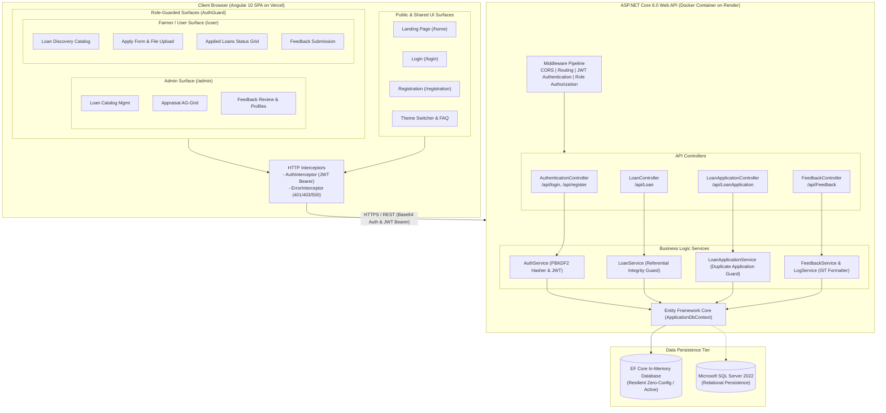
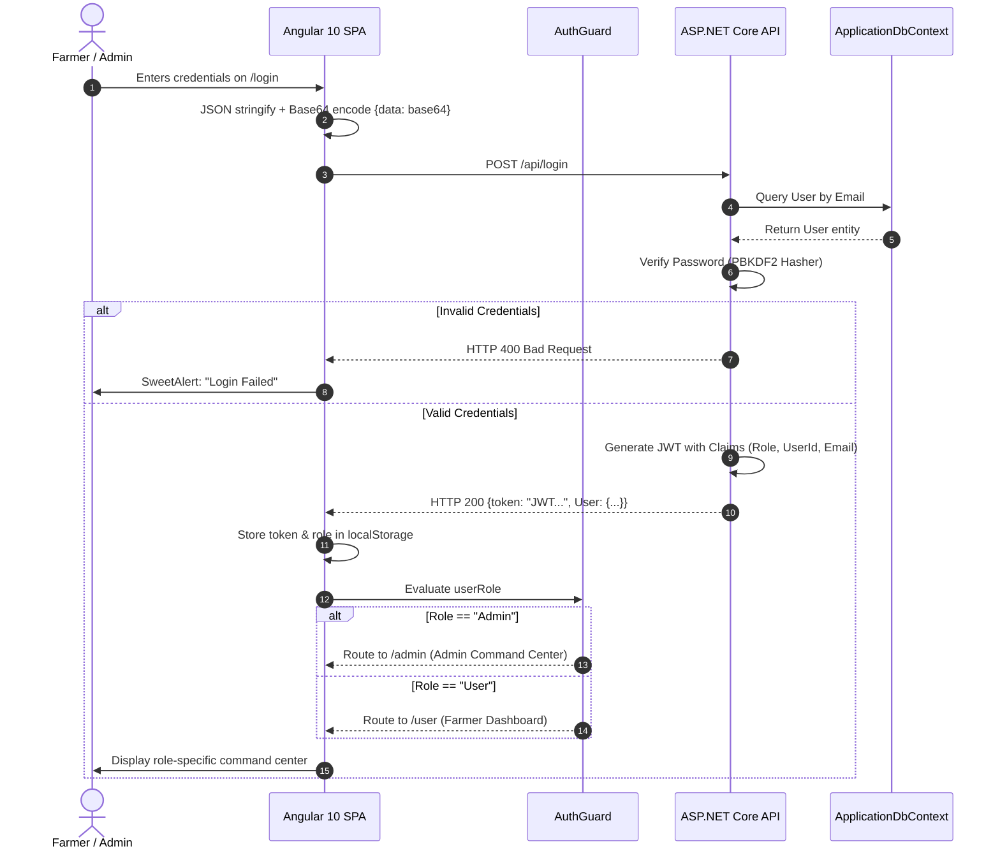
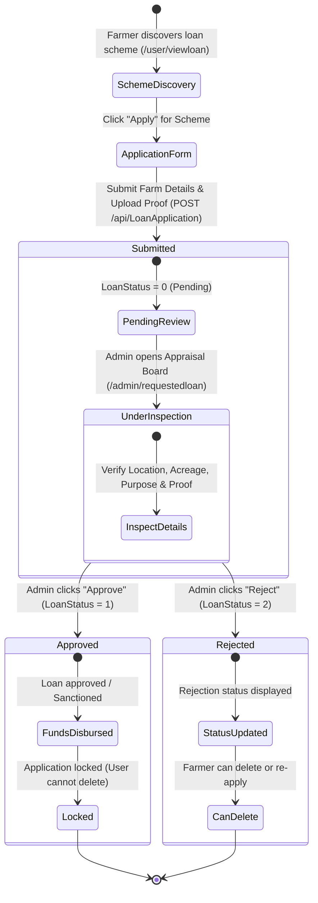
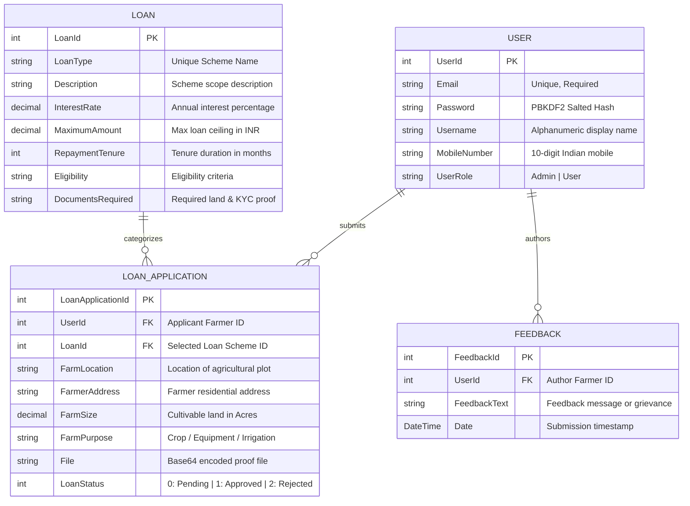
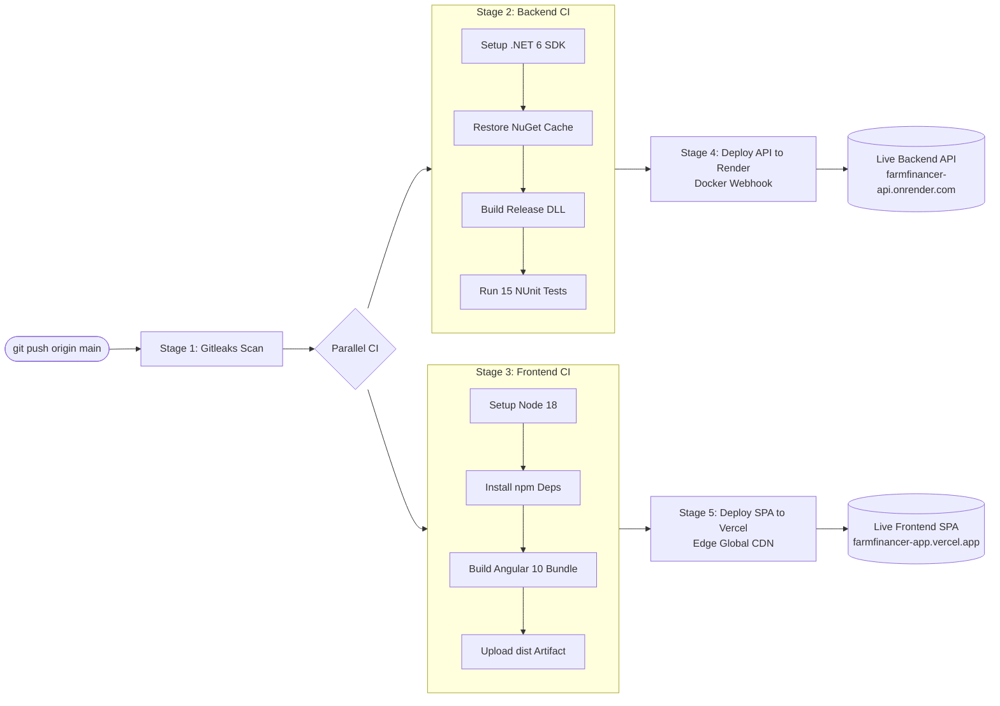

# Farmfinancer 🌾

> **Production-Grade Agricultural Loan & Finance Management Platform**  
> *Engineered with Angular 10, ASP.NET Core 6.0 Web API, and Entity Framework Core.*

---

## 1. Project Overview

**Farmfinancer** is a specialized financial technology web application designed to bridge the gap between agricultural lending institutions and rural farming communities. It streamlines the lifecycle of agricultural loans—from credit scheme catalog discovery and application submission to document verification, administrative appraisal, and user feedback.

### The Problem It Solves
Traditional agricultural lending in rural areas is hindered by bureaucratic friction, opaque eligibility requirements, physical paperwork delays, and fragmented communication between lenders and farmers. Farmfinancer solves this by digitizing the entire lending workflow:
- **For Farmers (Users)**: Offers transparent, self-service loan discovery, clear eligibility criteria, simple digital application submission with farm ownership/identity proof upload, real-time application status tracking, and direct feedback submission.
- **For Agricultural Credit Officers (Admins)**: Provides centralized scheme management (creation, updating, deprecation), credit application review with AG-Grid filtering, document inspection, approval/rejection workflows with referential integrity safeguards, and community feedback moderation.

> **Relationship Between Admin and User Surfaces:**  
> **Admins** configure loan schemes, inspect farm documentation, approve or reject applications, and review farmer feedback; **Users (Farmers)** discover loan schemes, apply with farm details and proof files, monitor application statuses, and submit operational feedback.

---

## 2. Architecture Overview

Farmfinancer follows a decoupled, client-server single-page application (SPA) architecture with strict role-based execution paths.

### High-Level System Architecture Diagram



### Authentication & Role-Based Authorization Flow



### Flow Divergence & Sharing

1. **Authentication Flow (Shared)**: Both roles hit the same authentication endpoint (`POST /api/login`). The backend deserializes the Base64 request body, validates the hashed password against the unified `Users` table, and issues a signed JWT containing claims for `ClaimTypes.Role` (`"Admin"` or `"User"`), `userId`, and `username`.
2. **Frontend Routing Flow (Divergent)**: The Angular `AuthGuard` evaluates the active user's decoded token role:
   - Routes prefixed with `/admin/*` reject non-admin users and redirect to `/home`.
   - Routes prefixed with `/user/*` reject non-user tokens and redirect to `/home`.
3. **Backend Authorization Flow (Divergent)**:
   - Administration endpoints (e.g., scheme mutation, approval status updates) enforce `[Authorize(Roles = "Admin")]`.
   - Farmer submission endpoints enforce `[Authorize]` with ownership filtering by `userId`.

### Production Tech Stack

| Layer | Technology | Manifest / Source Version | Purpose |
|---|---|---|---|
| **Frontend Framework** | Angular | `^10.1.6` (`angularapp/package.json`) | Single-page client application |
| **Language (Frontend)** | TypeScript | `~4.0.2` (`angularapp/package.json`) | Strongly-typed client codebase |
| **Styling & UI** | Vanilla CSS + Bootstrap + SweetAlert2 | `sweetalert2: ^11.26.3` | Custom responsive styles & alert dialogs |
| **Data Grid** | AG-Grid Angular | `^23.2.1` (`angularapp/package.json`) | High-performance filtering & appraisal tables |
| **Bot Protection** | Google reCAPTCHA v2 | `ng-recaptcha: ^6.0.0` | Client-side registration bot verification |
| **Backend Framework** | ASP.NET Core Web API | `net6.0` (`dotnetapp/dotnetapp.csproj`) | High-throughput RESTful service API |
| **ORM** | Entity Framework Core | `6.0.0` (`dotnetapp/dotnetapp.csproj`) | Relational database mapping & queries |
| **Identity & Security** | JWT Bearer Authentication | `Microsoft.AspNetCore.Authentication.JwtBearer: 6.0` | Stateless token-based authorization |
| **Password Security** | ASP.NET Core Identity Hasher | `PasswordHasher<User>` (PBKDF2 HMAC-SHA256) | Salted password hashing |
| **Logging** | log4net | `3.1.0` (`dotnetapp/dotnetapp.csproj`) | Rolling file diagnostics logger (`Logs/app.log`) |
| **API Documentation** | Swashbuckle (Swagger) | `6.2.3` (`dotnetapp/dotnetapp.csproj`) | Interactive OpenAPI documentation |
| **Primary Database** | Microsoft SQL Server | `2022-latest` (`docker-compose.yml`) | Enterprise relational datastore |
| **Fallback Database** | EF Core In-Memory | `6.0.0` (`dotnetapp/dotnetapp.csproj`) | Ephemeral, resilient offline/testing DB |
| **Containerization** | Docker & Docker Compose | Multi-stage Dockerfile (`dotnetapp/Dockerfile`) | Cloud-native backend packaging |
| **CI/CD** | GitHub Actions | Ubuntu Latest + Gitleaks Action v2 | Automated testing, scanning, and deployment |

---

## 3. Roles & Permissions Model

Farmfinancer enforces two distinct system roles, defined in `dotnetapp/Models/UserRoles.cs`:
- **`Admin`**: Agricultural credit administrator, financial manager, or compliance officer.
- **`User`**: Registered farmer, agricultural entrepreneur, or applicant.

### Permissions Matrix

| Feature / Operation | System Action | [Admin] | [User] | Unauthenticated / Guest | Enforcement Layer |
|---|---|:---:|:---:|:---:|---|
| **Landing & Information** | View home page, FAQ, animations | ✅ | ✅ | ✅ | Public route (`/home`) |
| **Account Creation** | Register as Farmer (`User`) | ❌ | ❌ | ✅ | `POST /api/register` |
| **Admin Account Creation** | Register as Administrator | ❌ | ❌ | ✅ (Requires `A123` Key) | Frontend client gate + `POST /api/register` |
| **Authentication** | Login and obtain JWT token | ✅ | ✅ | ✅ | `POST /api/login` |
| **Loan Schemes** | View list of active loan programs | ✅ | ✅ | ❌ | `GET /api/Loan` (`[Authorize]`) |
| **Loan Schemes** | View specific loan program details | ✅ | ✅ | ❌ | `GET /api/Loan/{id}` (`[Authorize]`) |
| **Loan Schemes** | Create new loan program | ✅ | ❌ | ❌ | `POST /api/Loan` (`[Authorize(Roles = "Admin")]`) |
| **Loan Schemes** | Update loan program details | ✅ | ❌ | ❌ | `PUT /api/Loan/{id}` (`[Authorize(Roles = "Admin")]`) |
| **Loan Schemes** | Delete loan program | ✅ | ❌ | ❌ | `DELETE /api/Loan/{id}` (`[Authorize(Roles = "Admin")]`) |
| **Loan Applications** | Apply for an agricultural loan | ❌ | ✅ | ❌ | `POST /api/LoanApplication` (`[Authorize]`) |
| **Loan Applications** | View own applied loans | ❌ | ✅ | ❌ | `GET /api/LoanApplication/user/{id}` (`[Authorize]`) |
| **Loan Applications** | Delete own pending application | ❌ | ✅ (Pending/Rejected only) | ❌ | `DELETE /api/LoanApplication/{id}` (`[Authorize]`) |
| **Loan Applications** | View all applications across system | ✅ | ❌ | ❌ | `GET /api/LoanApplication` (`[Authorize(Roles = "Admin")]`) |
| **Loan Applications** | Approve loan (`LoanStatus = 1`) | ✅ | ❌ | ❌ | `PUT /api/LoanApplication/{id}` (`[Authorize(Roles = "Admin")]`) |
| **Loan Applications** | Reject loan (`LoanStatus = 2`) | ✅ | ❌ | ❌ | `PUT /api/LoanApplication/{id}` (`[Authorize(Roles = "Admin")]`) |
| **Loan Applications** | Delete any loan application | ✅ | ❌ | ❌ | `DELETE /api/LoanApplication/{id}` (`[Authorize(Roles = "Admin")]`) |
| **Feedback** | Submit feedback for services | ❌ | ✅ | ❌ | `POST /api/Feedback` (`[Authorize]`) |
| **Feedback** | View own submitted feedbacks | ❌ | ✅ | ❌ | `GET /api/Feedback/user/{id}` (`[Authorize]`) |
| **Feedback** | Delete own submitted feedback | ❌ | ✅ | ❌ | `DELETE /api/Feedback/{id}` (`[Authorize]`) |
| **Feedback** | View all system feedback & user profiles | ✅ | ❌ | ❌ | `GET /api/Feedback` (`[Authorize(Roles = "Admin")]`) |
| **Feedback** | Delete any feedback | ✅ | ❌ | ❌ | `DELETE /api/Feedback/{id}` (`[Authorize(Roles = "Admin")]`) |

### Role Assignment Mechanics
- **Farmer (`User`)**: During registration, selecting the `User` role allows immediate signup without secret authorization tokens.
- **Administrator (`Admin`)**: During registration, selecting `Admin` unlocks the mandatory **Admin Key** field. The client validates `adminKey === 'A123'`. Without this exact key, the form rejects role selection and prevents submission.
- **Seeded Accounts**: On fresh startup, `dotnetapp/Data/DbInitializer.cs` automatically provisions default accounts for both roles if not already present in the database.

---

## 4. Features Implemented — Admin Side

The Admin side is accessed via `/admin` and provides complete managerial control over loan schemes, farmer applications, and platform feedback.

### 4.1. Admin Navigation Bar & Dashboard `[Admin]`
- **Description**: Dedicated navigation bar providing quick-access dropdowns for Loan Management, Feedback review, active username display, light/dark theme switching, and secure logout.
- **Implementation**:
  - Component: `angularapp/src/app/components/adminnav/adminnav.component.ts`
  - Template: `adminnav.component.html` & Styles: `adminnav.component.css`
- **Business Purpose**: Gives administrators an isolated command surface without polluting user navigation.
- **Access Control**: Angular `AuthGuard` checks `userRole === 'Admin'`.

### 4.2. Loan Scheme Creation `[Admin]`
- **Description**: Form allowing administrators to define and publish new agricultural loan schemes.
- **Implementation**:
  - Frontend: `angularapp/src/app/components/createloan/createloan.component.ts`
  - Backend Controller: `dotnetapp/Controllers/LoanController.cs` (`AddLoan`)
  - Backend Service: `dotnetapp/Services/LoanService.cs` (`AddLoan`)
- **Field Validations Enforced**:
  - `LoanType`: 3 to 10 characters, strictly checked against existing loans to prevent duplicates.
  - `Description`: 3 to 20 characters.
  - `InterestRate`: Numeric, > 0% and ≤ 100%. Negative numbers and characters `e`, `+`, `-` are blocked at keystroke level.
  - `MaximumAmount`: Up to ₹10,00,000 (enforced both live in input and upon submission).
  - `RepaymentTenure`: 1 to 360 months (up to 30 years).
  - `Eligibility` & `DocumentsRequired`: Mandatory text descriptions.
- **Access Control**: `[Authorize(Roles = "Admin")]` on `POST /api/Loan`.

### 4.3. Loan Scheme Catalog Management & Updating `[Admin]`
- **Description**: High-density AG-Grid table displaying all configured loan schemes with sorting, column-level search, floating filters, and actions to Edit or Delete.
- **Implementation**:
  - Catalog View: `angularapp/src/app/components/viewloan/viewloan.component.ts`
  - Edit View: `angularapp/src/app/components/admineditloan/admineditloan.component.ts`
  - Backend: `dotnetapp/Controllers/LoanController.cs` (`UpdateLoan`, `DeleteLoan`)
- **Referential Integrity Protection**:
  - In `dotnetapp/Services/LoanService.cs`, if an administrator attempts to delete a loan scheme that is currently referenced by any `LoanApplication`, the backend throws a custom `LoanException("Loan cannot be deleted as it is referenced in LoanApplication")`. The frontend intercepts this and displays an explanatory SweetAlert error dialog.
- **Access Control**: `[Authorize(Roles = "Admin")]` on `PUT /api/Loan/{id}` and `DELETE /api/Loan/{id}`.

### 4.4. Farmer Loan Application Appraisal (Requested Loans) `[Admin]`
- **Description**: Interactive AG-Grid appraisal board where administrators review all loan applications submitted by farmers across the country.
- **Implementation**:
  - Component: `angularapp/src/app/components/requestedloan/requestedloan.component.ts`
  - Template: `requestedloan.component.html`
  - Backend: `dotnetapp/Controllers/LoanApplicationController.cs` (`GetAllLoanApplications`, `UpdateLoanApplication`)
- **Appraisal Capabilities**:
  - **Status Filtering**: Filter by Pending (`0`), Approved (`1`), or Rejected (`2`).
  - **Quick Text Search**: Instant full-text search across applicant User IDs, Loan IDs, and Farm Purpose.
  - **Application Details Modal**: Inspect applicant's Farm Location, Farmer Address, Farm Size in Acres, Farm Purpose, and view/download the uploaded base64 proof document.
  - **One-Click Approval / Rejection**: Instant status toggle with confirmation modals. Approved loans disable the "Approve" button; Rejected loans disable the "Reject" button.
- **Access Control**: `[Authorize(Roles = "Admin")]` on `GET /api/LoanApplication` and `PUT /api/LoanApplication/{id}`.

### 4.5. Feedback Moderation & User Profiling `[Admin]`
- **Description**: Paginated review interface displaying feedback submitted by farmers, complete with applicant profile inspection.
- **Implementation**:
  - Component: `angularapp/src/app/components/adminviewfeedback/adminviewfeedback.component.ts`
  - Template: `adminviewfeedback.component.html`
  - Backend: `dotnetapp/Controllers/FeedbackController.cs` (`GetAllFeedback`)
- **Capabilities**:
  - Client-side pagination (10 feedback entries per page with previous/next controls).
  - Profile Modal (`openProfile(feedback)`): Pulls associated `User` object (Username, Email, Mobile Number) directly from the EF Core `.Include(f => f.User)` relation.
- **Access Control**: `[Authorize(Roles = "Admin")]` on `GET /api/Feedback`.

---

## 5. Features Implemented — User Side

The User side is accessed via `/user` and serves farmers seeking agricultural credit.

### 5.1. User Navigation Bar & Dashboard `[User]`
- **Description**: Farmer navigation interface featuring links to View Loans, Applied Loans, Feedback dropdown (Post Feedback / My Feedbacks), username badge, theme toggle, and logout.
- **Implementation**: `angularapp/src/app/components/usernav/usernav.component.ts`
- **Access Control**: Angular `AuthGuard` checks `userRole === 'User'`.

### 5.2. Loan Scheme Discovery `[User]`
- **Description**: Searchable AG-Grid catalog presenting available loan options with clear interest rates (`% p.a.`), maximum limits (formatted with Indian currency symbol `₹`), tenure durations, and eligibility requirements.
- **Implementation**:
  - Component: `angularapp/src/app/components/userviewloan/userviewloan.component.ts`
  - Template: `userviewloan.component.html`
  - Backend: `dotnetapp/Controllers/LoanController.cs` (`GetAllLoans`)
- **Dynamic Application State Awareness**:
  - On component load, the frontend fetches both all available loans and the user's previously applied loan IDs (`loadAppliedLoansPromise()`).
  - If a user has already applied for a scheme, the Action column renders `<button class="applied-btn" disabled>Applied</button>` to prevent duplicate applications.
  - If unapplied, an active `<button class="btn-apply">Apply</button>` navigates to the application form.

### 5.3. Loan Application Submission `[User]`
- **Description**: Reactive multi-field form enabling farmers to submit farm operational details and upload ownership or KYC proofs.
- **Implementation**:
  - Component: `angularapp/src/app/components/loanform/loanform.component.ts`
  - Template: `loanform.component.html`
  - Backend: `dotnetapp/Controllers/LoanApplicationController.cs` (`AddLoanApplication`)
  - Backend Service: `dotnetapp/Services/LoanApplicationService.cs`
- **Field Constraints & Validations**:
  - `Farm Location`: Required, 3 to 100 characters with live countdown.
  - `Farmer's Address`: Required, 3 to 100 characters.
  - `Farm Size in Acres`: Required numeric value, minimum 1 acre. Negative numbers blocked.
  - `Loan Purpose`: Required description of cultivation, equipment, or irrigation purpose (3 to 100 characters).
  - `Proof Document`: Mandatory file upload converted via `FileReader.readAsDataURL` to Base64 payload.
- **Duplicate Application Prevention**:
  - `LoanApplicationService.cs` queries `_context.LoanApplications.AnyAsync(la => la.LoanId == loanApplication.LoanId && la.UserId == loanApplication.UserId)`. If an application already exists, it throws `LoanException("User already applied for this loan")` and returns HTTP 400 Bad Request.

### 5.4. Application Tracking & Self-Service Cancellation `[User]`
- **Description**: AG-Grid dashboard displaying the farmer's submitted loan applications, submission timestamp, farm details, and current approval state.
- **Implementation**:
  - Component: `angularapp/src/app/components/userappliedloan/userappliedloan.component.ts`
  - Template: `userappliedloan.component.html`
  - Backend: `dotnetapp/Controllers/LoanApplicationController.cs` (`GetLoanApplicationsByUserId`)
- **Status Badges**:
  - `0`: **Pending** (Under administrative review)
  - `1`: **Approved** (Loan granted)
  - `2`: **Rejected** (Application turned down)
- **Safe Cancellation Rule**:
  - Farmers can delete their own application while it is **Pending** or **Rejected**.
  - If a loan is **Approved (`LoanStatus === 1`)**, deletion is strictly disabled: the button renders with class `disabled`, and clicking it triggers a warning: *"Approved loans cannot be deleted."*

#### Agricultural Loan Application & Appraisal Lifecycle



### 5.5. Farmer Feedback Submission `[User]`
- **Description**: Form enabling farmers to submit reviews, service requests, or grievances.
- **Implementation**:
  - Component: `angularapp/src/app/components/useraddfeedback/useraddfeedback.component.ts`
  - Backend: `dotnetapp/Controllers/FeedbackController.cs` (`AddFeedback`)
- **Validation**:
  - Text length: Between 10 and 100 characters.
  - Content regex: `/^[a-zA-Z0-9\s]+$/` (only alphanumeric characters and spaces permitted).

### 5.6. Feedback History & Deletion `[User]`
- **Description**: Chronological list of feedbacks submitted by the logged-in farmer with option to retract/delete entries.
- **Implementation**:
  - Component: `angularapp/src/app/components/userviewfeedback/userviewfeedback.component.ts`
  - Backend: `dotnetapp/Controllers/FeedbackController.cs` (`GetFeedbacksByUserId`, `DeleteFeedback`)

---

## 6. Features Implemented — Shared / Common

### 6.1. Interactive Landing Page `[Shared]`
- **Description**: Modern, high-aesthetic home page introducing Farmfinancer, highlighting features (Instant Application, Transparent Interest, Minimal Documentation, Quick Disbursement), animated flying coins, and an interactive FAQ accordion.
- **Implementation**:
  - Component: `angularapp/src/app/components/home/home.component.ts`
  - Effects Services: `MagicEffectsService` (mouse spotlight, 3D card tilt, particle trails) and `ThemeService`.

### 6.2. Unified Registration with reCAPTCHA `[Shared]`
- **Description**: Client registration handling both Farmer (`User`) and Officer (`Admin`) signups.
- **Implementation**:
  - Component: `angularapp/src/app/components/registration/registration.component.ts`
  - Backend: `dotnetapp/Controllers/AuthenticationController.cs` (`Register`)
- **Bot Defense & Input Security**:
  - Google reCAPTCHA v2 (`ng-recaptcha`) integration with dynamic site key binding and test-fallback token resolution.
  - Username: Alphanumeric only (regex `/^[a-zA-Z0-9]$/`), minimum 3 characters.
  - Mobile Number: Exactly 10 digits, must start with `6`, `7`, `8`, or `9`.
  - Password: Minimum 6 characters with live visibility toggle.
  - Passwords hashed on backend using ASP.NET Core Identity PBKDF2 (`_passwordHasher.HashPassword`).

### 6.3. Unified Login & Token Generation `[Shared]`
- **Description**: Single authentication gateway for both roles with automatic role-based redirect.
- **Implementation**:
  - Component: `angularapp/src/app/components/login/login.component.ts`
  - Backend: `dotnetapp/Controllers/AuthenticationController.cs` (`Login`)
  - Backend Service: `dotnetapp/Services/AuthService.cs` (`Login`)
- **Payload Security**:
  - The client Base64-encodes the credentials payload: `btoa(JSON.stringify(loginData))`.
  - The backend controller reads the raw request body stream, extracts the `"data"` property, decodes the Base64 string, validates the model, and executes password verification.
  - Upon success, returns signed JWT token and user profile. The client stores `jwtToken`, `currentUser`, and `userRole` in `localStorage`, then routes `Admin` to `/admin` and `User` to `/user`.

### 6.4. HTTP Interceptors `[Shared]`
- **`AuthInterceptor`** (`angularapp/src/app/interceptors/auth.interceptor.ts`): Automatically clones outgoing HTTP requests and injects the `Authorization: Bearer <jwtToken>` header if a token exists in `localStorage`.
- **`ErrorInterceptor`** (`angularapp/src/app/interceptors/error.interceptor.ts`): Centralized error listener that intercepts HTTP responses:
  - `401 Unauthorized`: Wipes `jwtToken` and `currentUser` from storage and immediately redirects to `/login`.
  - `403 Forbidden`: Logs security access denial.
  - `400 / 404 / 500`: Standardizes error message payloads for component consumers.

### 6.5. Display Formatting Pipes `[Shared]`
- **`CurrencyFormatPipe`** (`angularapp/src/app/pipes/currency-format.pipe.ts`): Formats numbers into Indian Rupee denomination (`₹ 5,00,000`).
- **`DateFormatPipe`** (`angularapp/src/app/pipes/date-format.pipe.ts`): Formats UTC ISO timestamps into readable localized dates (`dd/MM/yyyy`).
- **`TruncatePipe`** (`angularapp/src/app/pipes/truncate.pipe.ts`): Truncates long descriptions with ellipses (`...`) to preserve AG-Grid cell sizing.
- **`LoanStatusPipe`** & **`StatusBadgePipe`**: Transforms raw status integers (`0, 1, 2`) into semantic textual labels and CSS badge classes.

### 6.6. Health Check & Observability `[Shared]`
- **Description**: Public health check endpoints allowing uptime monitoring, container readiness checks, and load balancer validation.
- **Routes**:
  - `GET /health` and `GET /api/health`
- **Output**:
  ```json
  {
    "status": "Healthy",
    "service": "FarmFinancer API",
    "database": "InMemory",
    "version": "inmemory-v1",
    "timestamp": "2026-09-06T15:00:15.000Z"
  }
  ```

### 6.7. Data Model & Entity-Relationship Diagram (ERD) `[Shared]`

The relational schema is mapped via Entity Framework Core `ApplicationDbContext`:



---

## 7. Folder / File Structure

```
Farmfinancer/
├── .github/
│   └── workflows/
│       └── ci-cd.yml                   # [Shared] 5-Stage GitHub Actions CI/CD Pipeline
├── .gitleaks.toml                      # [Shared] Gitleaks secret scanning configuration
├── .gitignore                          # [Shared] Git ignore rules for .NET, Angular, and OS files
├── docker-compose.yml                  # [Shared] Local container orchestrator (API + SQL Server 2022)
├── vercel.json                         # [Shared] Vercel SPA routing rewrite rules & Node 18 build flags
│
├── dotnetapp/                          # =======================================================
│   │                                   # BACKEND: ASP.NET Core 6.0 Web API Monolith
│   │                                   # =======================================================
│   ├── Controllers/
│   │   ├── AuthenticationController.cs # [Shared] User & Admin login, registration, Base64 decoding
│   │   ├── FeedbackController.cs       # [Admin & User] Feedback CRUD with role attributes
│   │   ├── LoanApplicationController.cs# [Admin & User] Loan application submission, appraisal
│   │   └── LoanController.cs           # [Admin & User] Scheme catalog management & reading
│   ├── Data/
│   │   ├── ApplicationDbContext.cs     # [Shared] EF Core DbContext with User, Loan, Application, Feedback
│   │   └── DbInitializer.cs            # [Shared] Automatic startup database seeding (Admin, Farmer, Loans)
│   ├── Exceptions/
│   │   └── LoanException.cs            # [Shared] Custom business exception for validation/integrity
│   ├── Migrations/                     # [Shared] EF Core relational migration files
│   ├── Models/
│   │   ├── ApplicationUser.cs          # [Shared] Extended IdentityUser model
│   │   ├── Feedback.cs                 # [Shared] Feedback entity with User foreign key
│   │   ├── Loan.cs                     # [Shared] Loan scheme entity (rates, tenures, limits)
│   │   ├── LoanApplication.cs          # [Shared] Loan application entity with User and Loan keys
│   │   ├── LoginModel.cs               # [Shared] DTO for email/password credentials
│   │   ├── User.cs                     # [Shared] Unified application user entity
│   │   └── UserRoles.cs                # [Shared] Role constant strings ("Admin", "User")
│   ├── Services/
│   │   ├── AuthService.cs              # [Shared] Registration, PBKDF2 hashing, JWT token issuance
│   │   ├── FeedbackService.cs          # [Shared] Feedback data manipulation
│   │   ├── IAuthService.cs             # [Shared] Contract for authentication service
│   │   ├── ILogService.cs              # [Shared] Contract for audit logging service
│   │   ├── LoanApplicationService.cs   # [Shared] Application persistence, duplicate check
│   │   ├── LoanService.cs              # [Shared] Scheme persistence, referential integrity check
│   │   └── LogService.cs               # [Shared] log4net wrapper converting timestamps to IST
│   ├── Dockerfile                      # [Shared] Multi-stage production container build (SDK 6.0 + ASP.NET 6.0)
│   ├── Program.cs                      # [Shared] Entry point, DI container, JWT, CORS, Swagger, DB setup
│   ├── appsettings.json                # [Shared] Global configuration, connection strings, JWT keys
│   ├── appsettings.Development.json    # [Shared] Development environment overrides
│   ├── dotnetapp.csproj                # [Shared] .NET project file with NuGet package dependencies
│   ├── dotnetapp.sln                   # [Shared] Visual Studio solution file
│   └── log4net.config                  # [Shared] Rolling file appender configuration (Logs/app.log)
│
├── angularapp/                         # =======================================================
│   │                                   # FRONTEND: Angular 10 Single Page Application
│   │                                   # =======================================================
│   ├── src/
│   │   ├── app/
│   │   │   ├── components/
│   │   │   │   ├── admineditloan/      # [Admin] Edit loan scheme form with validations
│   │   │   │   ├── adminnav/           # [Admin] Admin navigation bar & hero dashboard
│   │   │   │   ├── adminviewfeedback/  # [Admin] Paginated feedback review & user profile modal
│   │   │   │   ├── animated-grid-pattern/ # [Shared] Canvas/CSS dynamic grid background
│   │   │   │   ├── authguard/          # [Shared] Route guard enforcing logged-in status & role checks
│   │   │   │   ├── createloan/         # [Admin] Create loan scheme form with limit checks
│   │   │   │   ├── error/              # [Shared] 404 Not Found error page
│   │   │   │   ├── faq-accordion/      # [Shared] FAQ interactive accordion widget
│   │   │   │   ├── home/               # [Shared] Public landing page with 3D spotlight & tilt
│   │   │   │   ├── letter-glitch/      # [Shared] Canvas cyber/glitch visual text effect
│   │   │   │   ├── loading-animation/  # [Shared] Animated page loader component
│   │   │   │   ├── loanform/           # [User] Farmer loan application form with file upload
│   │   │   │   ├── login/              # [Shared] Public login form with role routing
│   │   │   │   ├── navbar/             # [Shared] Public navigation bar (Login, Register)
│   │   │   │   ├── registration/       # [Shared] Registration form with reCAPTCHA & Admin Key
│   │   │   │   ├── requestedloan/      # [Admin] AG-Grid loan appraisal board (Approve/Reject)
│   │   │   │   ├── sparkles-text/      # [Shared] Decorative sparkle SVG text component
│   │   │   │   ├── theme-toggle/       # [Shared] Dark/Light theme switcher button
│   │   │   │   ├── useraddfeedback/    # [User] Farmer feedback submission form
│   │   │   │   ├── userappliedloan/    # [User] Farmer applied loans AG-Grid & delete logic
│   │   │   │   ├── usernav/            # [User] Farmer navigation bar & hero dashboard
│   │   │   │   ├── userviewfeedback/   # [User] Farmer feedback list with delete confirmation
│   │   │   │   ├── userviewloan/       # [User] Farmer loan catalog AG-Grid with "Applied" status
│   │   │   │   └── viewloan/           # [Admin] Admin loan catalog AG-Grid (Edit/Delete)
│   │   │   ├── interceptors/
│   │   │   │   ├── auth.interceptor.ts # [Shared] HTTP interceptor attaching JWT Bearer header
│   │   │   │   └── error.interceptor.ts# [Shared] HTTP interceptor managing 401/403/500 errors
│   │   │   ├── models/                 # [Shared] TypeScript interfaces matching C# entities
│   │   │   ├── pipes/                  # [Shared] Pipes for currency, dates, truncating, status
│   │   │   ├── services/
│   │   │   │   ├── auth.service.ts     # [Shared] Client authentication, token storage, user state
│   │   │   │   ├── feedback.service.ts # [Shared] Feedback API calls
│   │   │   │   ├── loan.service.ts     # [Shared] Loan & application API calls
│   │   │   │   ├── magic-effects.service.ts # [Shared] DOM animation effects (particles, tilt)
│   │   │   │   └── theme.service.ts    # [Shared] CSS theme variable switcher
│   │   │   ├── app-routing.module.ts   # [Shared] Route declarations, guards, and role metadata
│   │   │   └── app.module.ts           # [Shared] Angular root module declarations & imports
│   │   ├── environments/
│   │   │   ├── environment.ts          # [Shared] Local development environment config
│   │   │   └── environment.prod.ts     # [Shared] Production environment config (Render backend)
│   │   ├── karma.conf.js               # [Shared] Karma test runner configuration with Puppeteer
│   │   └── styles.css                  # [Shared] Global CSS variables, theme tokens, animations
│   ├── angular.json                    # [Shared] Angular CLI build, asset, and budget definitions
│   ├── package.json                    # [Shared] Node packages, build scripts, OpenSSL flags
│   └── tsconfig.json                   # [Shared] TypeScript compiler options
│
└── TestProject/                        # =======================================================
    │                                   # TESTING: NUnit Backend Integration & Unit Test Suite
    │                                   # =======================================================
    ├── UnitTest1.cs                    # [Shared] 15 Test cases covering Auth, Loan, App, Feedback
    └── TestProject.csproj              # [Shared] Test project file with NUnit & Coverlet packages
```

---

## 8. Environment Variables & Configuration

### Backend Configuration (`dotnetapp/appsettings.json` / Environment Variables)

| Variable Name | Purpose | Required / Optional | Default / Example | Used In | Scope |
|---|---|:---:|---|---|:---:|
| `ConnectionStrings__con` (`ConnectionStrings:con`) | SQL Server connection string | Optional (Falls back to In-Memory if omitted or points to localhost) | `Server=database,1433;Database=appdb;User Id=sa;Password=examlyMssql@123;Encrypt=false` | `Program.cs` | Global |
| `UseInMemoryDatabase` | Forces backend to run on EF Core In-Memory database regardless of connection string | Optional | `false` | `Program.cs` | Global |
| `Jwt__Key` (`jwt:Key`) | Secret key used to sign and verify HMAC-SHA256 JWT tokens | **Required** | `YourSuperSecretKeyForJWTTokenGeneration12345` | `Program.cs`, `AuthService.cs` | Global |
| `Jwt__Issuer` (`jwt:Issuer`) | Declared issuer claim for issued JWT tokens | **Required** | `FinancerPortalApi` | `Program.cs`, `AuthService.cs` | Global |
| `Jwt__Audience` (`jwt:Audience`) | Declared audience claim for issued JWT tokens | **Required** | `FinancerPortalClient` | `Program.cs`, `AuthService.cs` | Global |
| `Cors__AllowedOrigins__*` | Array of permitted external origins for Cross-Origin Resource Sharing | Optional | `http://localhost:4200`, `http://localhost:8081` (all `*.vercel.app` allowed by regex) | `Program.cs` | Global |
| `EnableSwagger` | Toggles OpenAPI/Swagger UI availability in production environments | Optional | `true` | `Program.cs` | Global |
| `ASPNETCORE_URLS` | Binding address and port for the Kestrel web server | Optional | `http://+:8080` | `Dockerfile`, Kestrel | Global |
| `ASPNETCORE_ENVIRONMENT` | Active runtime profile (`Development`, `Staging`, `Production`) | Optional | `Production` | .NET Runtime | Global |

### Frontend Configuration (`angularapp/src/environments/environment.ts`)

| Variable Name | Purpose | Required / Optional | Example Value | Scope |
|---|---|:---:|---|:---:|
| `production` | Angular build optimization flag | **Required** | `false` (dev) / `true` (prod) | Global |
| `apiUrl` | Root URL of backend API service | **Required** | `https://farmfinancer-api.onrender.com` or `http://localhost:8080` | Global |
| `baseUrl` | Endpoint prefix for authentication routes | **Required** | `https://farmfinancer-api.onrender.com/api` or `http://localhost:8080/api` | Global |
| `recaptchaSiteKey` | Google reCAPTCHA v2 public HTML site key | **Required** | `6LeIxAcTAAAAAJcZVRqyHh71UMIEGNQ_MXjiZKhI` | Shared (Auth) |

### CI/CD Secrets (GitHub Repository Secrets)

| Secret Name | Purpose | Required / Optional | Where Used |
|---|---|:---:|---|
| `VERCEL_TOKEN` | API Token to authenticate deployment actions with Vercel | Optional (Needed for automated Actions deployment) | `.github/workflows/ci-cd.yml` |
| `VERCEL_ORG_ID` | Vercel Team / User Account Identifier | Optional | `.github/workflows/ci-cd.yml` |
| `VERCEL_PROJECT_ID` | Target Vercel Project Identifier | Optional | `.github/workflows/ci-cd.yml` |
| `RENDER_DEPLOY_HOOK_URL` | Webhook URL to trigger automatic container rebuild on Render | Optional | `.github/workflows/ci-cd.yml` |
| `GITHUB_TOKEN` | GitHub-provided token for repository checkout and security scan | Automatically Provided | `.github/workflows/ci-cd.yml` |

---

## 9. Prerequisites

To run and build Farmfinancer locally, verify that your machine meets the following version specifications:

- **.NET SDK**: `6.0.x` (LTS) — *Optionally `8.0.x` for build agents, with target `net6.0`.*
- **Node.js**: `18.x` (Recommended LTS: `v18.20.0` or higher; works with `v20.x` via legacy OpenSSL flag).
- **npm**: `v8.x` or `v9.x` / `v10.x`.
- **Angular CLI**: `10.1.6` (`npm install -g @angular/cli@10.1.6`).
- **Database Engine**: Microsoft SQL Server 2022 (or Docker to run containerized SQL Server).
- **Git**: `v2.30+` with Gitleaks (`v8.x` optional for local secret auditing).

---

## 10. Installation & Setup

### Step 1: Clone the Repository
```bash
git clone https://github.com/Pulkit1822/Farmfinancer.git
cd Farmfinancer
```

### Step 2: Database Setup & Provisioning

You have two options for running the database:

#### Option A: Automatic In-Memory Mode (Zero Setup - Recommended for Quick Testing)
The application is pre-configured with resilient database fallback. If no local SQL Server is running, it automatically boots with EF Core In-Memory mode and seeds all test data on startup. No setup is required.

#### Option B: Microsoft SQL Server (Production Relational Mode)
If running a local SQL Server or Docker instance:
```bash
# Start SQL Server via Docker
docker run -e "ACCEPT_EULA=Y" -e "MSSQL_SA_PASSWORD=examlyMssql@123" -p 1433:1433 -d mcr.microsoft.com/mssql/server:2022-latest
```
Ensure `dotnetapp/appsettings.json` matches this connection string:
```json
"ConnectionStrings": {
  "con": "Server=localhost,1433;Database=appdb;User Id=sa;Password=examlyMssql@123;TrustServerCertificate=true;Encrypt=false"
}
```

### Step 3: Seed Data & Initial Accounts

When the backend boots, `DbInitializer.cs` runs automatically and seeds the following accounts:

| Role | Email | Password | Admin Key | Notes |
|---|---|---|:---:|---|
| **Admin** | `admin@farmfinancer.com` | `Admin@123` | `A123` | Pre-seeded system administrator |
| **Farmer (`User`)** | `farmer@farmfinancer.com` | `User@123` | N/A | Pre-seeded test farmer |

*It also seeds 4 real-world agricultural loan schemes: Kisan Crop Loan, Tractor & Machinery Loan, Drip Irrigation & Solar Pump Loan, and Dairy & Livestock Loan.*

#### Manual User Account Creation (Signup Flow)
1. Navigate to `/registration`.
2. Enter your Name, Email, 10-digit Mobile Number (starting with 6, 7, 8, or 9), and Password.
3. Select **Role: User**.
4. Complete the reCAPTCHA verification and click **Register**.

#### Manual Admin Account Creation
1. Navigate to `/registration`.
2. Fill in account details.
3. Select **Role: Admin**.
4. An **Admin Key** field will appear. Enter: `A123`.
5. Complete reCAPTCHA and click **Register**.

---

## 11. Running the Application

### 11.1. Local Development Mode

#### Terminal 1: Launch Backend API
```bash
cd dotnetapp
dotnet restore
dotnet run
```
- API Endpoint: `http://localhost:8080` (or `https://localhost:7071`)
- Interactive Swagger Documentation: `http://localhost:8080/swagger`
- System Health Check: `http://localhost:8080/health`

#### Terminal 2: Launch Frontend SPA
```bash
cd angularapp
npm install --legacy-peer-deps
export NODE_OPTIONS="--openssl-legacy-provider"
npm start
```
- Frontend Application URL: **`http://localhost:8081`** (or `http://localhost:4200`)
- Public / Landing: `http://localhost:8081/home`
- Admin Dashboard: `http://localhost:8081/admin` (Requires Admin login)
- Farmer Dashboard: `http://localhost:8081/user` (Requires User login)

---

### 11.2. Production Build

#### Backend Release Compilation
```bash
cd dotnetapp
dotnet publish dotnetapp.csproj -c Release -o ./publish /p:UseAppHost=false
```

#### Frontend Production Build
```bash
cd angularapp
export NODE_OPTIONS="--openssl-legacy-provider"
npm run build
```
*Compiled output generated in `angularapp/dist/angularapp` with production environment URL replacements.*

---

### 11.3. Docker Containerized Run (Full Stack)

To run the complete production stack (ASP.NET Core Web API + Microsoft SQL Server 2022) with health checks:
```bash
docker-compose up --build
```
- **Backend API**: `http://localhost:8080`
- **Swagger UI**: `http://localhost:8080/swagger`
- **SQL Server 2022**: `localhost:1433` (User: `sa`, Password: `examlyMssql@123`)

To tear down containers and persist data volumes:
```bash
docker-compose down
```

---

## 12. Running Tests

### 12.1. Backend Test Suite (.NET 6 NUnit)

The backend test suite is located in `TestProject/UnitTest1.cs` and executes 15 integration and unit tests covering Admin workflows, User workflows, authorization barriers, and business exceptions:

```bash
# Run all backend tests from root
dotnet test TestProject/TestProject.csproj --verbosity normal
```

#### Breakdown of Backend Test Cases:
1. `Backend_Test_Post_Method_Register_Admin_Returns_HttpStatusCode_OK`: Verifies admin registration.
2. `Backend_Test_Post_Method_Login_Admin_Returns_HttpStatusCode_OK`: Verifies admin authentication and token generation.
3. `Backend_Test_Post_Loan_With_Token_By_Admin_Returns_HttpStatusCode_OK`: Verifies admin can publish a loan scheme with JWT.
4. `Backend_Test_Post_Loan_Without_Token_By_Admin_Returns_HttpStatusCode_Unauthorized`: Verifies unauthenticated POST is blocked (HTTP 401).
5. `Backend_Test_Get_Method_Get_LoanById_In_Loan_Service_Fetches_Loan_Successfully`: Tests scheme retrieval by ID.
6. `Backend_Test_Put_Method_UpdateLoan_In_Loan_Service_Updates_Loan_Successfully`: Tests scheme mutation.
7. `Backend_Test_Delete_Method_DeleteLoan_In_Loan_Service_Deletes_Loan_Successfully`: Tests scheme deletion.
8. `Backend_Test_Post_Method_AddLoanApplication_In_LoanApplication_Service_Posts_Successfully`: Tests farmer application creation.
9. `Backend_Test_Get_Method_GetLoanApplicationByUserId_In_LoanApplication_Fetches_Successfully`: Tests user-specific application query.
10. `Backend_Test_Put_Method_Update_In_LoanApplication_Service_Updates_Successfully`: Tests status appraisal update.
11. `Backend_Test_Delete_Method_DeleteLoanApplication_Service_Deletes_LoanApplication_Successfully`: Tests application deletion.
12. `Backend_Test_Post_Method_AddFeedback_In_Feedback_Service_Posts_Successfully`: Tests feedback submission.
13. `Backend_Test_Delete_Method_Feedback_In_Feeback_Service_Deletes_Successfully`: Tests feedback deletion.
14. `Backend_Test_Get_Method_GetFeedbacksByUserId_In_Feedback_Service_Fetches_Successfully`: Tests user feedback isolation.
15. `Backend_Test_Post_Method_AddLoan_In_LoanService_Occurs_LoanException_For_Duplicate_LoanType`: Confirms `LoanException` throws on duplicate loan types.

---

### 12.2. Frontend Test Suite (Angular / Jasmine / Karma)

The frontend test suite contains 39 spec suites covering components, pipes, guards, and services:

```bash
cd angularapp
npm test -- --watch=false --browsers=ChromeHeadless
```

---

### 12.3. Secret & Credential Scanning (Gitleaks)

To audit the repository for leaked API tokens, private keys, or passwords:
```bash
# Run locally (requires gitleaks installed via brew/binary)
gitleaks detect -v --config .gitleaks.toml

# Or via npm script in angularapp
npm --prefix angularapp run security:scan
```

---

## 13. API Reference / Routes

All API endpoints are hosted under `/api`. All protected endpoints require standard HTTP Bearer token authentication:  
`Authorization: Bearer <JWT_TOKEN>`

### 13.1. Admin Routes `[Admin]`

| Method | Endpoint Path | Description | Authorization Required | Request Body Shape | Response Body Shape |
|---|---|---|---|---|---|
| `POST` | `/api/Loan` | Create a new loan scheme | `[Authorize(Roles = "Admin")]` | JSON `Loan` (Type, Description, InterestRate, MaxAmount, Tenure, Eligibility, Docs) | HTTP 200 `"Loan added successfully"` or HTTP 500 |
| `PUT` | `/api/Loan/{loanId}` | Update an existing loan scheme | `[Authorize(Roles = "Admin")]` | JSON `Loan` object | HTTP 200 `"Loan updated successfully"` or HTTP 404 |
| `DELETE` | `/api/Loan/{loanId}` | Delete a loan scheme | `[Authorize(Roles = "Admin")]` | None | HTTP 200 `"Loan deleted successfully"` (Throws `LoanException` if referenced) |
| `GET` | `/api/LoanApplication` | Retrieve all applications across all users | `[Authorize(Roles = "Admin")]` | None | HTTP 200 JSON array of `LoanApplication[]` |
| `PUT` | `/api/LoanApplication/{id}` | Approve (`1`) or Reject (`2`) an application | `[Authorize(Roles = "Admin")]` | JSON `LoanApplication` with updated `LoanStatus` | HTTP 200 `"Loan application updated successfully"` |
| `DELETE` | `/api/LoanApplication/{id}` | Administrative deletion of an application | `[Authorize(Roles = "Admin")]` | None | HTTP 200 `"Loan application deleted successfully"` |
| `GET` | `/api/Feedback` | Retrieve all feedbacks with applicant user profile | `[Authorize(Roles = "Admin")]` | None | HTTP 200 JSON array of `Feedback[]` (Includes `User` object) |
| `GET` | `/api/Feedback/{id}` | Retrieve specific feedback by ID | `[Authorize(Roles = "Admin")]` | None | HTTP 200 JSON `Feedback` object |
| `PUT` | `/api/Feedback/{id}` | Update feedback entry | `[Authorize(Roles = "Admin")]` | JSON `Feedback` object | HTTP 200 JSON updated `Feedback` |
| `DELETE` | `/api/Feedback/{id}` | Administrative deletion of feedback | `[Authorize(Roles = "Admin")]` | None | HTTP 204 NoContent |

---

### 13.2. User & Shared Routes `[User / Shared]`

| Method | Endpoint Path | Role / Audience | Description | Authorization Required | Request Body Shape | Response Body Shape |
|---|---|:---:|---|:---:|---|---|
| `POST` | `/api/login` | `[Shared]` | Authenticate credentials and receive JWT | None (Public) | `{"data": "<BASE64_ENCODED_LOGIN_JSON>"}` | `{"token": "<JWT>", "User": {...}}` |
| `POST` | `/api/register` | `[Shared]` | Create a new user or admin account | None (Public) | `{"data": "<BASE64_ENCODED_USER_JSON>"}` | `{"message": "User registered successfully"}` |
| `GET` | `/api/Loan` | `[Shared]` | View active catalog of loan schemes | `[Authorize]` | None | HTTP 200 JSON array of `Loan[]` |
| `GET` | `/api/Loan/{loanId}` | `[Shared]` | View details of a specific loan scheme | `[Authorize]` | None | HTTP 200 JSON `Loan` object |
| `POST` | `/api/LoanApplication` | `[User]` | Submit a new loan application with farm proof | `[Authorize]` | JSON `LoanApplication` (UserId, LoanId, FarmLocation, FarmSize, File) | HTTP 200 `"Loan application added successfully"` |
| `GET` | `/api/LoanApplication/user/{userId}` | `[User]` | View applications belonging to specific user | `[Authorize]` | None | HTTP 200 JSON array of `LoanApplication[]` |
| `DELETE` | `/api/LoanApplication/{id}` | `[User]` | Delete own pending application | `[Authorize]` | None | HTTP 200 `"Loan application deleted successfully"` |
| `POST` | `/api/Feedback` | `[User]` | Submit feedback or query | `[Authorize]` | JSON `Feedback` (UserId, FeedbackText, Date) | HTTP 200 `true` / HTTP 400 `false` |
| `GET` | `/api/Feedback/user/{userId}` | `[User]` | Retrieve feedbacks submitted by user | `[Authorize]` | None | HTTP 200 JSON array of `Feedback[]` |
| `DELETE` | `/api/Feedback/{id}` | `[User]` | Delete own submitted feedback | `[Authorize]` | None | HTTP 204 NoContent |
| `GET` | `/health` | `[Shared]` | Diagnostic status and database probe | None (Public) | None | `{"status": "Healthy", "database": "..."}` |

---

## 14. Deployment

### Live Production Deployments
- **Production Frontend (Vercel)**: **[https://farmfinancer-app.vercel.app](https://farmfinancer-app.vercel.app)**
- **Alternative Mirror (Vercel)**: **[https://farm-financer.vercel.app](https://farm-financer.vercel.app)**
- **Backend API (Render)**: **[https://farmfinancer-api.onrender.com](https://farmfinancer-api.onrender.com)**
- **API Health Check**: **[https://farmfinancer-api.onrender.com/health](https://farmfinancer-api.onrender.com/health)**
- **Swagger Documentation**: **[https://farmfinancer-api.onrender.com/swagger](https://farmfinancer-api.onrender.com/swagger)**

---

### 14.1. Frontend Deployment Architecture (Vercel)
The Angular SPA is deployed to Vercel's Edge Network:
1. **Root Directory**: `angularapp`
2. **Build Configuration**:
   - Build Command: `NODE_OPTIONS=--openssl-legacy-provider ng build --prod`
   - Output Directory: `dist/angularapp`
   - Install Command: `npm install --legacy-peer-deps`
3. **Single Page Application Rewrites (`vercel.json`)**:
   All dynamic client routes (`/admin/*`, `/user/*`, `/registration`) rewrite to `/index.html` to prevent 404 errors on browser page reloads:
   ```json
   {
     "rewrites": [
       { "source": "/(.*)", "destination": "/index.html" }
     ]
   }
   ```

---

### 14.2. Backend Deployment Architecture (Render / Docker)
Because ASP.NET Core and Entity Framework Core require a persistent runtime environment, the backend is containerized via `dotnetapp/Dockerfile`:
1. **Runtime**: Linux container built on `mcr.microsoft.com/dotnet/aspnet:6.0`.
2. **Port Configuration**: `ENV ASPNETCORE_URLS=http://+:8080`, exposing port `8080`.
3. **Continuous Deployment Webhook**: Render provides a Deploy Hook triggered automatically by the GitHub Actions pipeline upon push to `main`.
4. **Cold Start Note**: On free cloud tiers (such as Render Free), containers spin down after 15 minutes of inactivity; the initial wake-up request may take 30–50 seconds.

---

### 14.3. GitHub Actions CI/CD Pipeline
The workflow in [`.github/workflows/ci-cd.yml`](file:///.github/workflows/ci-cd.yml) executes across 5 sequential and parallel stages:
1. **`gitleaks`**: Scans the git tree for credentials using `.gitleaks.toml`.
2. **`backend-ci`**: Restores NuGet cache, compiles `dotnetapp.csproj` in Release mode, and runs unit tests.
3. **`frontend-ci`**: Restores npm cache, builds the Angular 10 production bundle with legacy OpenSSL provider, and uploads the compiled bundle artifact.
4. **`deploy-frontend-vercel`**: Deploys the verified Angular bundle to Vercel.
5. **`deploy-backend`**: Pings the Render deployment webhook to pull and rebuild the new container image.



---

## 15. Security Considerations

### 15.1. Authentication & Role Privilege Separation
- **Unified Identity Table**: All accounts reside in the `Users` table, with role distinction enforced by the `UserRole` column (`Admin` vs `User`).
- **HMAC-SHA256 Token Signing**: JWT tokens are signed using a symmetric secret key. Claims include `ClaimTypes.Role`, `ClaimTypes.NameIdentifier`, `"userId"`, and `"username"`.
- **Backend Route Guarding**: Administrative endpoints enforce `[Authorize(Roles = "Admin")]`. If an authenticated user with role `User` attempts to invoke an admin endpoint (e.g. `DELETE /api/Loan/1`), ASP.NET Core immediately rejects the call with **HTTP 403 Forbidden**.
- **Frontend Route Guarding**: Angular's `AuthGuard` inspects the active token and blocks cross-role access:
  - Non-admins accessing `/admin/*` are immediately navigated back to `/home`.
  - Non-users accessing `/user/*` are navigated to `/home`.
  - Unauthenticated users attempting to access any protected route are navigated to `/login`.

### 15.2. Admin Registration Security Gate
- **Client-Side Admin Key**: When a user selects the `Admin` role during registration, the form requires an **Admin Key** (`A123`). The registration button and role selector will not activate without this key.
- **Architectural Note**: In the current implementation, this verification occurs on the client. For high-security environments, the `adminKey` should also be received and validated directly within `AuthService.Registration`.

### 15.3. Password Security & Hashing
- Passwords are never stored in plaintext.
- Passwords are hashed using ASP.NET Core Identity's standard `PasswordHasher<User>`, which utilizes salted **PBKDF2 with HMAC-SHA256** and automatic salt generation.

### 15.4. Cross-Origin Resource Sharing (CORS) Policy
In `dotnetapp/Program.cs`, the CORS policy dynamically permits:
- Any origin ending in `.vercel.app` (`uri.Host.EndsWith(".vercel.app")`), allowing production and preview deployments on Vercel.
- Local development origins: `http://localhost:4200`, `http://localhost:8081`.
- Any custom origins configured in `appsettings.json`.

### 15.5. Token Expiration & Invalidation
- JWT tokens are configured with a strict **24-hour lifetime** (`DateTime.UtcNow.AddHours(24)`).
- The client-side `ErrorInterceptor` intercepts any HTTP 401 response, purges `jwtToken` and `currentUser` from browser `localStorage`, and triggers a hard redirect to `/login`.

---

## 16. Known Issues / Technical Debt / TODOs

### Admin-Side `[Admin]`
- **Audit Trail Logging**: While `LogService` writes authentication attempts to `Logs/app.log`, administrative loan status approvals (`Approve` / `Reject`) and loan deletions are not yet logged with timestamped administrative actor IDs.
- **Bulk Application Actions**: In `requestedloan.component.ts`, approvals and rejections must be processed one row at a time; no batch checkbox selection exists for bulk loan processing.

### User-Side `[User]`
- **Base64 Document Storage**: In `loanform.component.ts`, uploaded farmer proof documents are converted to Base64 strings and stored directly in the `File` database column. For large PDFs or images, this increases database payload size. Migrating to an S3-compatible cloud object store (or using the existing `/uploadedFiles` static directory) is recommended.
- **Application Editing**: Farmers cannot edit an application after submission. If an error was made in the farm acreage or location, they must delete the application and submit a new one.

### Shared / Architectural `[Shared]`
- **In-Memory Fallback vs Relational Persistence**: When running on Render Free tier without a configured external cloud SQL database, the backend falls back to EF Core In-Memory mode. Any new loans, applications, or users created in this mode will reset if the container restarts. To ensure permanent data retention, connect a persistent cloud database (e.g. Azure SQL, Supabase PostgreSQL, or Railway MSSQL).
- **Backend Admin Key Validation**: Move the `A123` Admin Key verification from `RegistrationComponent.ts` to `AuthService.cs` on the backend to prevent direct API spoofing of the `UserRole` field.

---

## 17. Troubleshooting / FAQ

### Q1: Why am I getting "Invalid domain for site key" on the registration page?
**Root Cause**: Google reCAPTCHA v2 restricts site keys to designated domains (e.g., `localhost` or custom URLs).  
**Solution**: The application uses the universal test key `6LeIxAcTAAAAAJcZVRqyHh71UMIEGNQ_MXjiZKhI`, which allows local and test domains without error. If a network failure or domain rejection occurs, the component automatically falls back to an internal test token so registration is never blocked.

### Q2: I can't log in with the Admin account. What are the default credentials?
- **Email**: `admin@farmfinancer.com`
- **Password**: `Admin@123`
- If you are creating a new Admin account via the UI, ensure you enter **Admin Key**: `A123`.

### Q3: Why does the first request to the live backend take 30–40 seconds?
**Root Cause**: The backend is hosted on Render's free tier, which automatically spins down the container after 15 minutes of inactivity.  
**Solution**: This is normal for free hosting. The first request will wake up the container; all subsequent requests will be instantaneous.

### Q4: When deleting a loan scheme as an Admin, why does it say "Loan cannot be deleted"?
**Root Cause**: Referential integrity protection in `LoanService.cs`.  
**Solution**: You cannot delete a loan scheme if one or more farmers have active applications referencing that `LoanId`. You must first reject or delete the associated applications in the **Requested Loans** dashboard before deleting the loan scheme.

### Q5: Why is the Delete button disabled for my loan application?
**Root Cause**: Business rule in `userappliedloan.component.ts`.  
**Solution**: Once an application has been **Approved (`LoanStatus = 1`)**, farmers cannot delete it. Only applications that are **Pending** or **Rejected** can be retracted by the applicant.

### Q6: Angular build fails with `error:0308010C:digital envelope routines::unsupported`.
**Root Cause**: Node.js 17+ uses OpenSSL 3.0, which deprecates legacy hashing algorithms used by Webpack 4 in Angular 10.  
**Solution**: Set the legacy OpenSSL provider before running Angular CLI:
```bash
export NODE_OPTIONS="--openssl-legacy-provider"
npm start
```

---

## 👨‍💻 Maintainer & Engineering Hand-Off

- **Repository**: [https://github.com/Pulkit1822/Farmfinancer](https://github.com/Pulkit1822/Farmfinancer)
- **Primary Live Frontend**: [https://farmfinancer-app.vercel.app](https://farmfinancer-app.vercel.app)
- **Live Backend API**: [https://farmfinancer-api.onrender.com](https://farmfinancer-api.onrender.com)
- **CI/CD Pipeline**: GitHub Actions (Gitleaks, .NET CI, Angular CI, Vercel CD, Render CD)